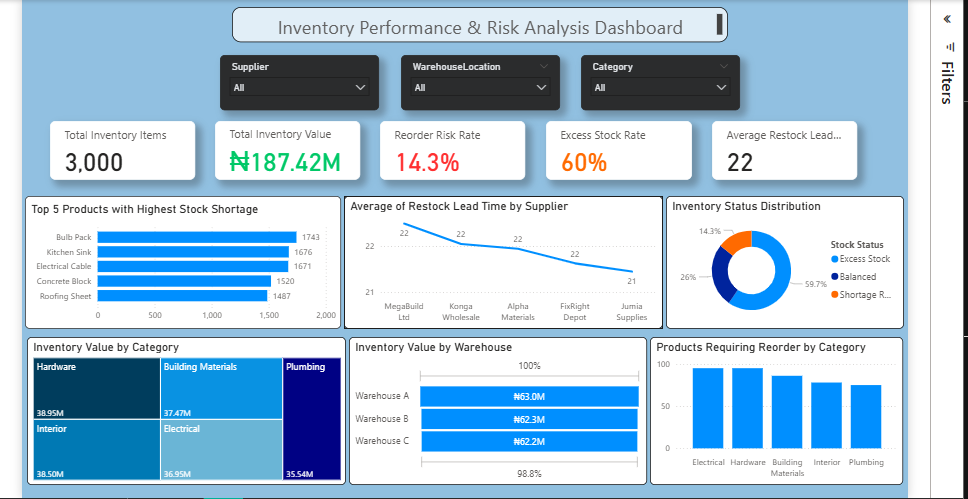
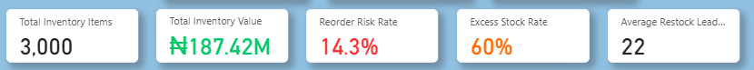

# Inventory Performance & Risk Analysis Dashboard Using Power BI

## Project Overview

This project presents an interactive Inventory Performance and Risk Analysis Dashboard developed using Power BI. The dashboard analyses inventory performance across products, categories, suppliers, and warehouse locations.

The aim of the dashboard is to help businesses monitor stock levels, identify reorder risks, detect excess stock, evaluate supplier restock lead times, and understand inventory value distribution across warehouses and product categories.

---

## Business Problem

Inventory mismanagement can lead to stock shortages, excess inventory, delayed replenishment, poor warehouse allocation, and increased operational costs.

This dashboard was designed to answer key business questions such as:

- Which products have the highest stock shortage?
- Which product categories require reorder attention?
- What percentage of inventory is at reorder risk?
- What percentage of inventory is excess stock?
- Which suppliers have longer restock lead times?
- How is inventory value distributed across warehouses and categories?

---

## Dashboard Preview

The dashboard provides a high-level overview of inventory health, stock value, reorder risk, excess stock rate, supplier performance, and inventory distribution.



---

## Key Metrics

- Total Inventory Items: 3,000
- Total Inventory Value: ₦187.42M
- Reorder Risk Rate: 14.3%
- Excess Stock Rate: 60%
- Average Restock Lead Time: 22 days

---

## KPI Overview

The KPI section summarises the most important inventory performance indicators. These include total inventory items, total inventory value, reorder risk rate, excess stock rate, and average restock lead time.



---

## Stock Shortage Analysis

This section identifies the top products with the highest stock shortages. It helps decision-makers quickly detect products that may require urgent restocking.

The dashboard highlights products such as bulbs, kitchen sinks, electrical cables, concrete blocks, and roofing sheets as products with significant stock shortage levels.


---

## Reorder Risk Analysis

The reorder risk analysis shows products requiring reorder by category. This helps the business understand which product categories are most exposed to stock shortage risks.

The dashboard shows a reorder risk rate of 14.3%, indicating that a portion of inventory requires replenishment attention.


---

## Excess Stock Analysis

The dashboard identifies excess stock levels within the inventory. The excess stock rate is shown as 60%, suggesting that a significant portion of products may be overstocked.

This insight can help reduce unnecessary holding costs and improve inventory planning.


---

## Supplier Lead Time Analysis

This section compares average restock lead time across suppliers. It helps identify suppliers with longer delivery periods and supports better procurement planning.


---

## Inventory Value by Category

The category analysis shows how inventory value is distributed across product categories such as hardware, building materials, plumbing, interior, and electrical products.

This helps identify categories with the highest inventory investment.


---

## Inventory Value by Warehouse

The warehouse analysis compares inventory value across different warehouse locations. This helps evaluate stock allocation and warehouse-level inventory distribution.


---

## Dashboard Features

The dashboard includes:

- KPI cards showing total inventory items, inventory value, reorder risk, excess stock rate, and average restock lead time.
- Stock shortage analysis showing the top products with the highest shortage levels.
- Supplier lead time analysis comparing average restock lead time across suppliers.
- Inventory status distribution showing excess stock, balanced stock, and shortage risk.
- Inventory value analysis by product category.
- Inventory value analysis by warehouse location.
- Reorder analysis showing products requiring reorder by category.

---

## Key Insights

- The dashboard analysed 3,000 inventory items.
- Total inventory value was approximately ₦187.42M.
- Reorder risk rate was 14.3%, showing that some products require replenishment attention.
- Excess stock rate was 60%, indicating possible overstocking and inefficient stock holding.
- Supplier restock lead time averaged 22 days.
- Inventory value was distributed across different warehouses and product categories.

---

## Tools Used

- Power BI
- DAX
- Microsoft Excel
- Data Visualisation
- Business Intelligence Reporting

---

## Skills Demonstrated

- Power BI dashboard development
- DAX measure creation
- Inventory performance analysis
- KPI reporting
- Data cleaning and modelling
- Business intelligence storytelling
- Data visualisation design
- Operational insight generation

---

## Project Files

```text
Inventory_Performance_Dashboard.pbix
README.md
dashboard_screenshot.png
kpi_cards.png
Top 5 products with highest shortage.png
products requring reorder by category.png
inventory status distribution.png
Line chart average restock lead time.png
Treemap inventory value by category.png
Inventory value by warehouse funnel map.png
```

---

## Conclusion

This Power BI dashboard provides a clear and interactive view of inventory performance and risk. It supports better stock monitoring, reorder planning, supplier evaluation, warehouse allocation, and inventory cost control.

The project demonstrates how business intelligence can transform raw inventory data into actionable operational insights.
